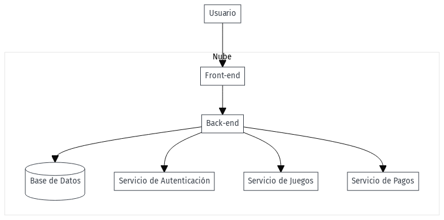
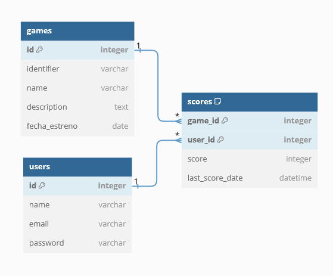

# FASE DE DISEÑO

- [FASE DE DESEÑO](#fase-de-diseño)
  - [1- Diagrama da arquitectura](#1--diagrama-de-la-arquitectura)
  - [2- Casos de uso](#2--casos-de-uso)
  - [3- Diagrama de Base de Datos](#3--diagrama-de-base-de-datos)
  - [4- Deseño de interface de usuarios](#4--diseño-de-interfaz-de-usuarios)

## 1- Diagrama de la arquitectura

La arquitectura de este proyecto sería algo así:

En este caso especifícamente con estas tecnologías:

## 2- Casos de uso

El usuario podrá registrarse, iniciar sesión, jugar y guardar sus puntuaciones, editar usuario y realizar pagos.

## 3- Diagrama de Base de Datos

El diseño de la base de datos consta de tres tablas: "games", "users" y "scores". 

La tabla "games" almacena información sobre los juegos, incluyendo un identificador único, nombre, descripción y fecha de estreno.

La tabla "users" almacena información de los usuarios, incluyendo un identificador único, nombre, correo electrónico y contraseña.

La tabla "scores" almacena los puntajes de los usuarios en los juegos, con claves foráneas que hacen referencia a los identificadores de los juegos y usuarios correspondientes. Además, se registra la fecha del último puntaje obtenido.

Las relaciones entre las tablas son las siguientes:
- La tabla "scores" tiene una clave foránea "game_id" que referencia al identificador de un juego en la tabla "games".
- La tabla "scores" también tiene una clave foránea "user_id" que referencia al identificador de un usuario en la tabla "users".

Estas relaciones permiten asociar los puntajes de los usuarios con los juegos y usuarios correspondientes.

## 4- Diseño de interfaz de usuarios

Revisar prototipo de figma.